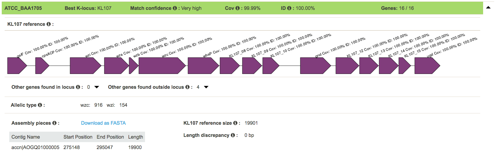
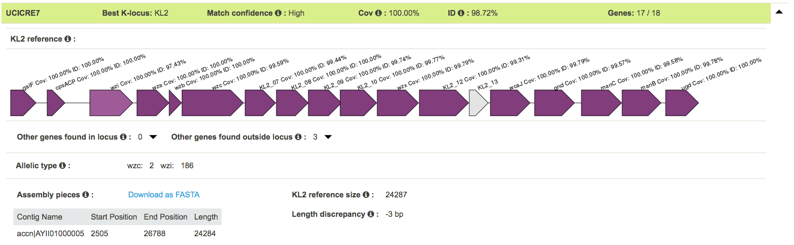
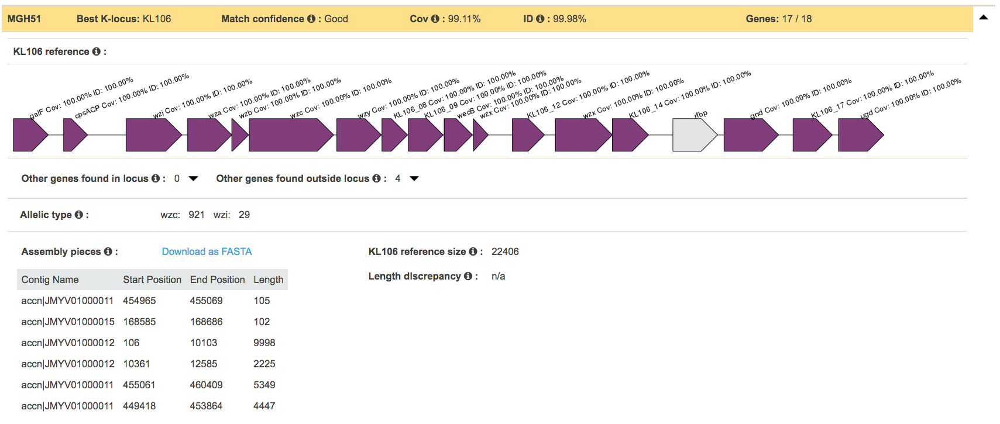
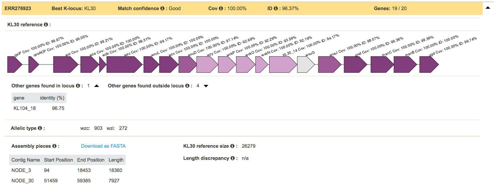
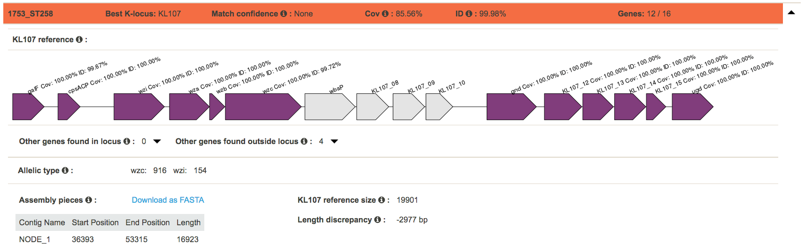
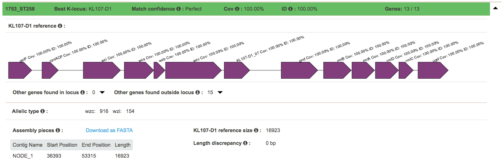

## Welcome to the documentation page for Kaptive Web

**Kaptive Web** is a tool for bacterial surface polysaccharide locus typing and variant evaluation. It takes one or more pre-assembled genomes and for each finds the best matching locus from a reference database. 

Given a novel genome and a database of known loci, **Kaptive** will help you to decide whether your sample has a known or a novel locus. It carries out the following for each input genome assembly:
* BLAST for all known K-locus nucleotide sequences (using `blastn`) to identify the best match ('best' defined as having the highest coverage).
* Extract the region(s) of the assembly which correspond to the BLAST hits (i.e. the locus sequence in the assembly) and save it to a FASTA file.
* BLAST for all known locus genes (using `tblastn`) to identify which expected genes (genes in the best matching locus) are present/missing and whether any unexpected genes (genes from other loci) are present.
* Visualise the results on-screen in the form of images and tables.
* Summarise the results in downloadable table and json files.

**Kaptive** will indicate the confidence of the locus match.

In cases where your input assembly closely matches a known locus, **Kaptive** will indicate a "Perfect" or "Very High" confidence match. 

If **Kaptive** has lower confidence in the match it may mean that your assembly contains a novel locus type, a deletion or an insertion sequence variant of a known locus. Alternatively it may mean that your input assembly was not of sufficient quality to make a confident match (e.g. if it is very fragmented).

**Kaptive** cannot reliably extract or annotate novel locus sequences – if you think you have a novel locus type you should investigate this further. If you think you may have a variant of a known locus, and you haven't already done so, you could try rerunning Kaptive with the appropriate variant database.

If you do have a novel locus or novel variant and you would like it to be added to the database, [please let us know](https://github.com/kelwyres/Kaptive-Web/issues).

If you use **Kaptive Web** in your research, please cite this paper alongside the appropriate [reference database citations](https://github.com/kelwyres/Kaptive-Web#citation):
[Kaptive Web: user-friendly capsule and lipopolysaccharide serotype prediction for _Klebsiella_ genomes. doi: 10.1101/260125](https://www.biorxiv.org/content/early/2018/02/05/260125)

If you use the command-line version of **Kaptive** ([download here](https://github.com/katholt/kaptive)), please cite this paper:
[Identification of _Klebsiella_ capsule synthesis loci from whole genome data. doi: 10.1099/mgen.0.000102](http://mgen.microbiologyresearch.org/content/journal/mgen/10.1099/mgen.0.000102)

## Table of Contents

* [Input assemblies](https://github.com/kelwyres/Kaptive-Web#input-assemblies)
* [Results](https://github.com/kelwyres/Kaptive-Web#results)
* [Example results and interpretation](https://github.com/kelwyres/Kaptive-Web#example-results-and-interpretation)
  * [Very close match](https://github.com/kelwyres/Kaptive-Web#very-close-match)
  * [More distant match](https://github.com/kelwyres/Kaptive-Web#more-distant-match)
  * [Broken assembly](https://github.com/kelwyres/Kaptive-Web#broken-assembly)
  * [Poor match - possible novel locus](https://github.com/kelwyres/Kaptive-Web#poor-match---possible-novel-locus)
  * [Poor match - possible novel variant](https://github.com/kelwyres/Kaptive-Web#poor-match---possible-novel-variant)
* [FAQs](https://github.com/kelwyres/Kaptive-Web#faqs)
* [Citation](https://github.com/kelwyres/Kaptive-Web#citation)
* [Installation](https://github.com/kelwyres/Kaptive-Web#installation)
* [License](https://github.com/kelwyres/Kaptive-Web#license)
 

## Input assemblies

**Kaptive** takes as input one or more pre-assembled bacterial genomes. We use [Unicycler](https://github.com/rrwick/Unicycler) to generate high quality short-read or hybrid assemblies, but you can use your favourite assembly program.
Assemblies can be uploaded in FASTA or zipped FASTA format. Or you can upload multiple assemblies in a zipped directory (one file per sample).

## Results

When your job(s) are completed the results will be shown on-screen and will be available for access for up to 7 days - so make sure to note your token!
You can also download a summary results table, a summary json file and/or the individual K-locus FASTA sequences extracted from your input assemblies.

Find more details about these outputs [here](https://github.com/katholt/kaptive#output-files).

## Match confidence 
This is a categorical measure of match quality that was originally optimised for use with the primary _Klebsiella_ K locus database:
* `Perfect` = the locus was found in a single piece with 100% coverage and 100% identity.
* `Very high` = the locus was found in a single piece with ≥99% coverage and ≥95% identity, with no missing genes and no extra genes.
* `High` = the locus was found in a single piece with ≥99% coverage, with ≤ 3 missing genes and no extra genes.
* `Good` = the locus was found in a single piece or with ≥95% coverage, with ≤ 3 missing genes and ≤ 1 extra genes.
* `Low` = the locus was found in a single piece or with ≥90% coverage, with ≤ 3 missing genes and ≤ 2 extra genes.
* `None` = did not qualify for any of the above.

We have found that these categorial measures also work quite well with the _Klebsiella_ O locus database, as well as the _A. baumannii_ K and OC locus databases.

WARNING: If you use the variant _Klebsiella_ K locus database please inspect your results carefully and decide for yourself what constitutes a confident match!

## Example results and interpretation

These results were generated using _Klebsiella_ genome assemblies and the _Klebsiella_ K locus primary reference database.

#### Very close match

The genome ATCC_BAA1705 is a close match to KL107 with 100% `blastn` identity at 100% coverage. The K locus was found in a single assembly piece and was exactly the same length as the reference. 
All of the expected KL107 genes were found in the K locus region of the assembly with high `tblastx` coverage and identity (indicated by dark purple shading). 
No unexpected genes were found in the K locus region of the assembly and only a small number were found outside of the K locus region of the assembly, which is as expected since some K locus genes share similarity with genes in other regions of the genome. 

#### More distant match

The genome UCICRE7 is a more distant match to KL2. It has 100% `blastn` coverage but only 98.72% identity. The K locus region of the assembly is in a single piece but it is 3bp shorter than the reference.
Most of the expected KL2 genes were found within the K locus region of the assembly at high `tblastx` coverage and identity (dark purple shading) but KL2-13 was missing (grey shading). 
Together the results suggest there may be a small deletion causing a frame-shift mutation within KL2-13. 

#### Broken assembly

The genome MGH51 seems to be a reasonable match to the KL106 reference (99.11% coverage and 99.95% identity by `blastn`). However, the K locus region of its assembly is in at least 6 pieces! 
When an assembly is broken into multiple pieces we should also treat <b>Kaptive's</b> results cautiously because we can't be sure about the true order of the pieces and we may have missed some pieces that contain novel genes (**Kaptive** can't find these because it only searches for known locus genes).  

#### Poor match - possible novel locus

The genome ERR276923 best matches the KL30 reference (100% `blastn` coverage and 96.37% identity) but is missing one of the expected KL30 genes (<i>wcuG</i>, indicated by grey shading) and has an unexpected gene within the K locus region of the assembly (KL104_18).
Five expected KL30 genes also have low coverage and/or identity `tblastx` matches (light purple shading). These genes are all in the capsule-specific region of the locus (the centre) and are adjacent to the missing gene. The combination of these results (clustered low quality gene matches, a missing gene and an unexpected gene) suggest that this genome may have a novel K locus.
However, the K locus region of the ERR276923 assembly is in multiple pieces so care should be taken when interpreting these results. In such a case we recommend further investigation e.g. exploring the K locus region of the assembly graph to check for other assembly contigs that may be part of the K locus - if these contigs contain completely novel genes **Kaptive** cannot find them!

#### Poor match - possible novel variant

The genome 1753_ST258 is a partial match to KL107 with 99.98% `blastn` identity but only 85.56% coverage. The K locus region of the assembly is in one piece from the left-most _galF_ gene to the right-most _ugd_ gene, homologues of both of which are found in almost all K loci.
However, the K locus region of the assembly is 2977bp shorter than the reference, and four genes are missing from the centre of the locus (<i>wbaP</i>, KL107_08, KL107_09 and KL107_10 shown in grey).
In fact, 1753_ST258 is a deletion variant of KL107. Running **Kaptive** with the _Klebsiella_ K locus variants database shows that it is a very good match to KL107-D1 (shown below).

  

## Databases available in Kaptive Web

References for <i>Klebsiella pneumoniae</i> species complex and <i>Acinetobacter baumannii</i> are available in **Kaptive Web**. You can run the [command-line version of Kaptive](https://github.com/katholt/kaptive) with any appropriately formatted database of your own.

The databases were developed and curated by [Kelly Wyres](https://holtlab.net/kelly-wyres/) (_Klebsiella_) and [Johanna Kenyon](https://research.qut.edu.au/infectionandimmunity/projects/bacterial-polysaccharide-research/) (_A. baumannii_).

If you have a locus database that you would like to be added to **Kaptive Web** for use by yourself and others in the community, please get in touch via the [issues page](https://github.com/katholt/Kaptive/issues) or [email](mailto:kaptive.typing@gmail.com) . Similarly, if you have identified new locus variants not currently in the existing databases, let us know!  

#### _Klebsiella_ K locus databases

The _Klebsiella_ K locus primary reference database (`Klebsiella_k_locus_primary_reference.gbk`) comprises full-length (_galF_ to _ugd_) annotated sequences for each distinct _Klebsiella_ K locus, where available:
* KL1 - KL77 correspond to the loci associated with each of the 77 serologically defined K-type references.
* KL101 and above are defined from DNA sequence data on the basis of gene content.

Note that insertion sequences (IS) are excluded from this database since we assume that the ancestral sequence was likely IS-free and IS transposase genes are not specific to the K locus.
Synthetic IS-free K locus sequences were generated for K loci for which no naturally occurring IS-free variants have been identified to date.

The variants database (`Klebsiella_k_locus_variant_reference.gbk`) comprises full-length annotated sequences for variants of the distinct loci:
* IS variants are named as KLN -1, -2 etc e.g. KL15-1 is an IS variant of KL15.
* Deletion variants are named KLN-D1, -D2 etc e.g. KL15-D1 is a deletion variant of KL15.
Note that KL156-D1 is included in the primary reference database since no full-length version of this locus has been identified to date. 

We recommend screening your data with the primary reference database first to find the best-matching K locus type. If you have poor matches or are particularly interested in detecting variant loci you should try the variant database.
WARNING: If you use the variant database please inspect your results carefully and decide for yourself what constitutes a confident match! Kaptive is not optimised for accurate variant detection. 

Database versions:
* Kaptive releases v0.5.1 and below include the original _Klebsiella_ K locus databases, as described in [Wyres, K. et al. Microbial Genomics (2016).](http://mgen.microbiologyresearch.org/content/journal/mgen/10.1099/mgen.0.000102)
* Kaptive v0.6.0 includes four novel primary _Klebsiella_ K locus references defined on the basis of gene content (KL162-KL165) in this [paper.](https://www.biorxiv.org/content/10.1101/557785v1)
* Kaptive v0.7.1 and above contain updated versions of the KL53 and KL126 loci (see table below for details). The updated KL126 locus sequence will be described in McDougall, F. et al. 2020 in prep.
* Kaptive v0.7.2 and above include a novel primary _Klebsiella_ K locus reference defined on the basis of gene content (KL166), which will be described in Li, M. et al. 2020. Characterization of clinically isolated hypermucoviscous _Klebsiella pneumoniae_ in Japan. _In prep._
* Kaptive v0.7.3 and above include four novel primary _Klebsiella_ K locus references defined on the basis of gene content (KL167-KL170), which will be described in Gorrie, C. et al. 2020. Opportunity and diversity: A year of _Klebsiella pneumoniae_ infections in hospital. _In prep._

Changes to the _Klebsiella_ K locus primary reference database:

| Locus  | Change | Reason | Date of change | Kaptive version no. |
| ------------- | ------------- | ------------- | ------------- | ------------- |
| KL53  | Annotation update: _wcaJ_ changed to _wbaP_ | Error in original annotation | 21 July 2020 | v 0.7.1 | 
| KL126  | Sequence update: new sequence from isolate FF923 includes _rmlBADC_ genes between _gnd_ and _ugd_ | Assembly scaffolding error in original sequence from isolate A-003-I-a-1 | 21 July 2020 | v 0.7.1 |

#### _Klebsiella_ O locus database

The _Klebsiella_ O locus database (`Klebsiella_o_locus_primary_reference.gbk`) contains annotated sequences for 12 distinct _Klebsiella_ O loci.

O locus classification requires some special logic, as the O1 and O2 serotypes contain the same locus genes. It is two additional genes elsewhere in the chromosome (_wbbY_ and _wbbZ_) which results in the O1 antigen. Kaptive therefore looks for these genes to properly call an assembly as either O1 or O2. When only one of the two additional genes can be found, the result is ambiguous and Kaptive will report a locus type of O1/O2.

Read more about the O locus and its classification here: [The diversity of _Klebsiella_ pneumoniae surface polysaccharides](https://www.ncbi.nlm.nih.gov/pmc/articles/PMC5320592/).

Database versions:
* Kaptive v0.4.0 and above include the original version of the _Klebsiella_ O locus database, as described in [Wick, R. et al. J Clin Microbiol (2019).](http://jcm.asm.org/content/56/6/e00197-18) 

#### _Acinetobacter baunannii_ K and OC locus databases

The _A. baumannii_ K (capsule) locus reference database (`Acinetobacter_baumannii_k_locus_primary_reference.gbk`) contains annotated sequences for 92 distinct K loci.
The _A. baumannii_ OC (lipooligosaccharide outer core) locus reference database (`Acinetobacter_baumannii_OC_locus_primary_reference.gbk`) contains annotated sequences for 12 distinct OC loci.

WARNING: These databases have been developed and tested specifically for _A. baumannii_ and may not be suitable for screening other _Acinetobacter_ species. You can check that your assembly is a true _A. baumannii_ by screening for the _oxaAB_ gene e.g. using blastn.

 Database versions:
* Kaptive v0.7.0 and above include the original _A. baumannii_ K and OC locus databases, as described in [Wyres, KL. et al. Microbial Genomics (2020).](https://doi.org/10.1099/mgen.0.000339)

Lists of papers describing each of the individual _A. baumannii_ reference loci can be found [here](https://github.com/katholt/Kaptive/tree/master/extras).

## FAQs

#### Why are there locus genes found outside the locus?

For _Klebsiella_ K loci in particular, a number of the K-locus genes are orthologous to genes outside of the K-locus region of the genome. E.g the _Klebsiella_ K-locus <i>man</i> and <i>rml</i> genes have orthologues in the LPS (lipopolysacharide) locus; so it is not unusual to find a small number of genes "outside" the locus.
However, if you have a large number of genes (>5) outside the locus it may mean that there is a problem with the locus match, or that your assembly is very fragmented or contaminated (contains more than one sample).

#### How can my sample be missing locus genes when it has a full-length, high identity locus match?

Kaptive uses 'tblastn' to screen for the presence of each locus gene with a coverage threshold of 90%. A single non-sense mutation or small indel in the centre of a gene will interrupt the 'tblastn' match and cause it to fall below the 90% threshold. However, such a small change has only a minor effect on the nucleotide 'blast' match across the full locus.

#### Why does the _Klebsiella_ K-locus region of my sample contain a <i>ugd</i> gene matching another locus?

A small number of the original _Klebsiella_ K locus references are truncated, containing only a partial <i>ugd</i> sequence. The reference annotations for these loci do not include <i>ugd</i>, so are not identified by the 'tblastn' search. Instead <b>Kaptive</b> reports the closest match to the partial sequence (if it exceeds the 90% coverage threshold). 

## Installation
If you would like to install and run your own version of **Kaptive Web**, follow the instructions [here](./INSTALL.md).

## License

GNU General Public License, version 3

http://dx.doi.org/10.5281/zenodo.55773

