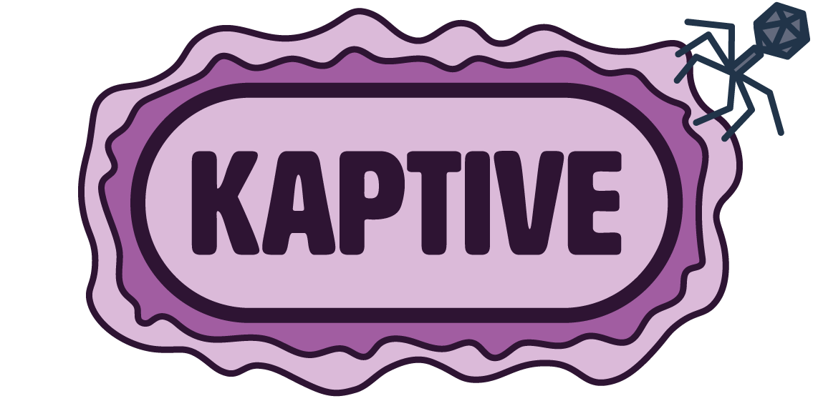
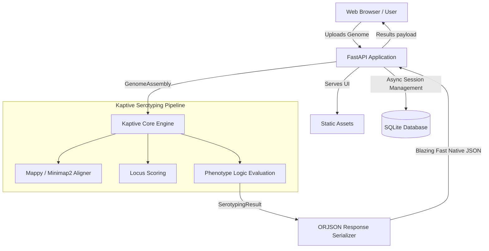

<div class="parent-container">
  <div class="centered-child" align="center">
    
    <br><br>
    <a href="https://pypi.org/project/kaptive-web/">
      
    </a>&nbsp;
    <a href="https://fastapi.tiangolo.com/">
      
    </a>&nbsp;
    <a href="https://github.com/astral-sh/ruff">
      
    </a>&nbsp;
    <a href="https://github.com/astral-sh/ty">
      
    </a>&nbsp;
    <a href="https://github.com/psf/black">
      
    </a>
  </div>
</div>

**Kaptive** reports information about surface polysaccharide loci (such as capsular K loci and outer core O loci) for *Klebsiella pneumoniae* species complex and *Acinetobacter baumannii* genome assemblies. 

**Kaptive Web** is hosted online at [kaptive-web.erc.monash.edu](https://kaptive-web.erc.monash.edu). This repository hosts the open-source code used to run the site, allowing you to deploy Kaptive-Web locally or on your own infrastructure.

For information on how to interpret the results of Kaptive and read about the core algorithms, please visit the [Official Kaptive Docs](https://kaptive.readthedocs.io/en/latest/).

---

## 📖 Background & History

In bacterial genomics, determining the serotype (surface polysaccharide structures) is critical for tracking outbreaks, understanding virulence, and vaccine development. The core **Kaptive** engine was built to take genome assemblies and rapidly map them to known locus databases using a highly-optimized alignment and scoring algorithm.

Historically, running Kaptive required command-line expertise. **Kaptive-Web** was created to democratize access to this powerful tool, providing researchers of all computational skill levels an intuitive web portal to upload assemblies, run the serotyper, and interactively explore the results. 

## 🏗️ v2 Design, Implementation & Layout (FastAPI)

Kaptive-Web v2 has been completely rewritten from the ground up to be faster, more robust, and easier to deploy. 

The backend is built in modern Python (3.11+) using **FastAPI**. It leverages asynchronous I/O and direct integration with the Kaptive core API. To handle the massive, complex dataclasses and NumPy arrays generated by Kaptive's internal engine, the API utilizes a custom **ORJSON** response class, binding directly to C-hooks for blistering fast serialization.

### Backend Architecture Diagram


```mermaid
graph TD
    Client[Web Browser / User] -->|Uploads Genome| API[FastAPI Application]
    API -->|Serves UI| Frontend[Static Assets]
    API -->|Async Session Management| SQLite[(SQLite Database)]
    
    API -->|GenomeAssembly| Core[Kaptive Core Engine]
    
    subgraph Kaptive Serotyping Pipeline
        Core --> Mappy[Mappy / Minimap2 Aligner]
        Core --> Scorer[Locus Scoring]
        Core --> Phenotype[Phenotype Logic Evaluation]
    end
    
    Phenotype -->|SerotypingResult| Serializer[ORJSON Response Serializer]
    Serializer -->|Blazing Fast Native JSON| API
    API -->|Results payload| Client
```

### Frontend Implementation

The frontend is a lightweight, responsive interface bundled directly with the application. It consists of static HTML, CSS, and Vanilla JavaScript assets (located in `src/kaptive_web/frontend/`) that are served via FastAPI's `StaticFiles` integration. It handles file chunking, progress reporting, and rendering the rich JSON responses from the backend into human-readable tables, badges, and interactive components.

---

## 🛠️ Installation

You can install `kaptive-web` using standard Python package managers. We highly recommend using `uv` for lightning-fast dependency resolution.

### Using `uv` (Recommended)
```bash
# Install globally or in a virtual environment
uv pip install kaptive-web

# Or, if you've cloned the repository and want an editable install:
uv sync
```

### Using `pip`
```bash
pip install kaptive-web
```

---

## 🚀 Usage & Deployment

Kaptive-Web is designed to be completely flexible. Whether you are a solo researcher running it locally, or a sysadmin deploying it on an HPC or Cloud cluster, there is an execution method for you.

### 1. The Native CLI Hook
The easiest way to run the local development server is using the native CLI command installed by `pyproject.toml`. This starts the Uvicorn server on `127.0.0.1:8000`.

```bash
kaptive-web

# Or if using uv to manage environments:
uv run kaptive-web
```

### 2. The `justfile` (Task Runner)
If you have [just](https://github.com/casey/just) installed, the project comes with a `justfile` containing handy aliases for common tasks. Simply type `just` to see all commands!

* `just serve` - Syncs dependencies and runs the development server.
* `just test` - Runs the pytest suite.
* `just clean` - Cleans up pycache and virtual environments.

### 3. Container Managers
For production deployments or HPC environments, containerization is fully supported.

**Docker & Docker Compose**
* `just docker-build` (Builds the standalone `kaptive-web:latest` image)
* `just docker-serve` (Spins up Kaptive-Web and a Caddy reverse proxy using Docker Compose in detached mode)
* `just docker-stop` (Tears down the compose stack)

**Singularity & Apptainer**
For HPC environments where Docker is not permitted, you can build Singularity or Apptainer images (`.sif` files).
* `just singularity-build` (Builds via `Singularity.def`)
* `just apptainer-build` (Builds via `Apptainer.def`)

Once built, you can run the container directly:
```bash
# Example Apptainer usage
apptainer run kaptive-web.sif
```
